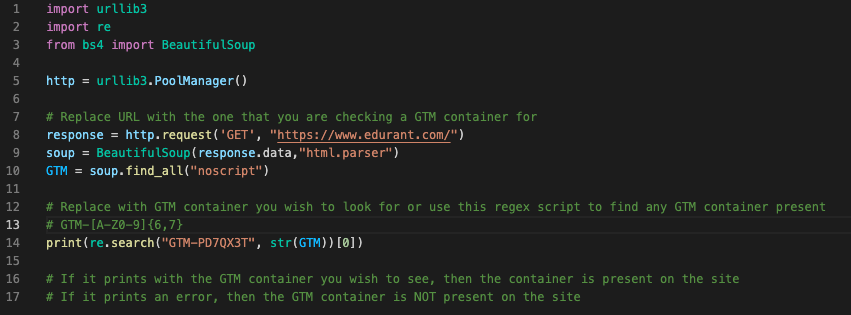

# README.md Template

## Description

Python web scraper for verifying the Google Tag Manager container on any given website.

## Table of Contents

-   [Technology](#technology)
-   [Installations](#installations)
-   [User-Story](#user-story)
-   [Links](#links)
-   [Usage](#usage)
-   [License](#license)

## Technology

- Python
- Beautiful Soup

## Installations

The web scraper will run using a code editor. I recommend using VS Code. Download instructions [here](https://code.visualstudio.com/download).

You will also need to have Python installed on your machine. Download instructions [here](https://www.python.org/downloads/).

Once the code editor and Python is installed, you have the option to either copy and paste the web scraper into a file, or you can clone the repository in your code editor. Refer to this [documentation](https://docs.github.com/en/repositories/creating-and-managing-repositories/cloning-a-repository) on how to clone a repository.

## User Story

- When the user installs the application, then they will have access to the python web scraper
- When the user inputs the URL, GTM container (or regex script), and runs the script, then a message will print in the terminal
- When a user receives a GTM container (either hard-coded in the script or using the regex script), then the GTM container printed in the terminal is present on the site
- When a user receives an error message in the terminal, then the GTM container is not present on the site

## Links

Put any relevant links in this section. You should include a link to your deployed application and a link to your repository at minimum.

## Usage
Here is the code that you would run in a code editor (in this example, I am using VS Code). Replace the URL with the URL you wish to verify the GTM container in as well as the GTM container itself. There is also a regex script included in a comment if you'd rather print any GTM container already embedded in the site.

Using VS Code, click on this icon to run the python file. Other code editors may have a similar feature. Please consult the relevant documentation.

If it is successful, then the GTM container will print in the terminal.

Otherwise, an error will be printed in the terminal. This means that given the specifications, the web scraper was not able to find a valid match

## License
(MIT) Copyright 2022 Alyssa Cuson

Permission is hereby granted, free of charge, to any person obtaining a copy of this software and associated documentation files (the "Software"), to deal in the Software without restriction, including without limitation the rights to use, copy, modify, merge, publish, distribute, sublicense, and/or sell copies of the Software, and to permit persons to whom the Software is furnished to do so, subject to the following conditions:

The above copyright notice and this permission notice shall be included in all copies or substantial portions of the Software.

THE SOFTWARE IS PROVIDED "AS IS", WITHOUT WARRANTY OF ANY KIND, EXPRESS OR IMPLIED, INCLUDING BUT NOT LIMITED TO THE WARRANTIES OF MERCHANTABILITY, FITNESS FOR A PARTICULAR PURPOSE AND NONINFRINGEMENT. IN NO EVENT SHALL THE AUTHORS OR COPYRIGHT HOLDERS BE LIABLE FOR ANY CLAIM, DAMAGES OR OTHER LIABILITY, WHETHER IN AN ACTION OF CONTRACT, TORT OR OTHERWISE, ARISING FROM, OUT OF OR IN CONNECTION WITH THE SOFTWARE OR THE USE OR OTHER DEALINGS IN THE SOFTWARE.
